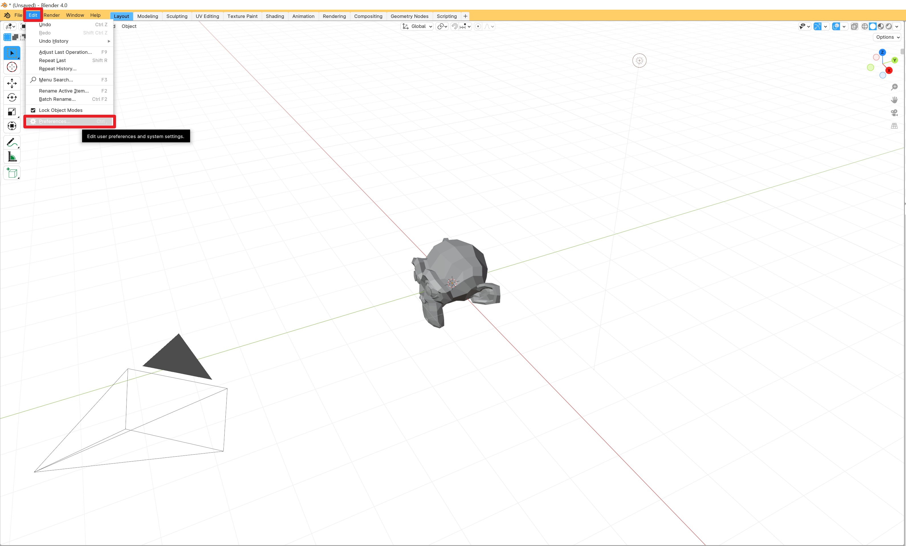
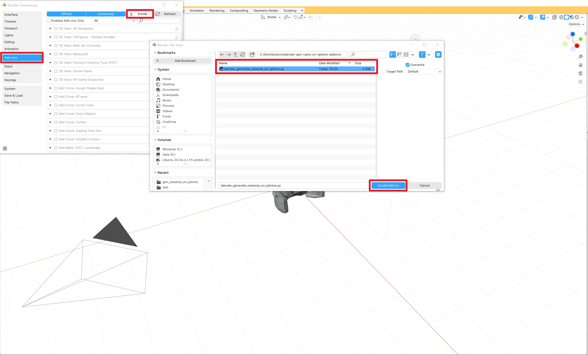
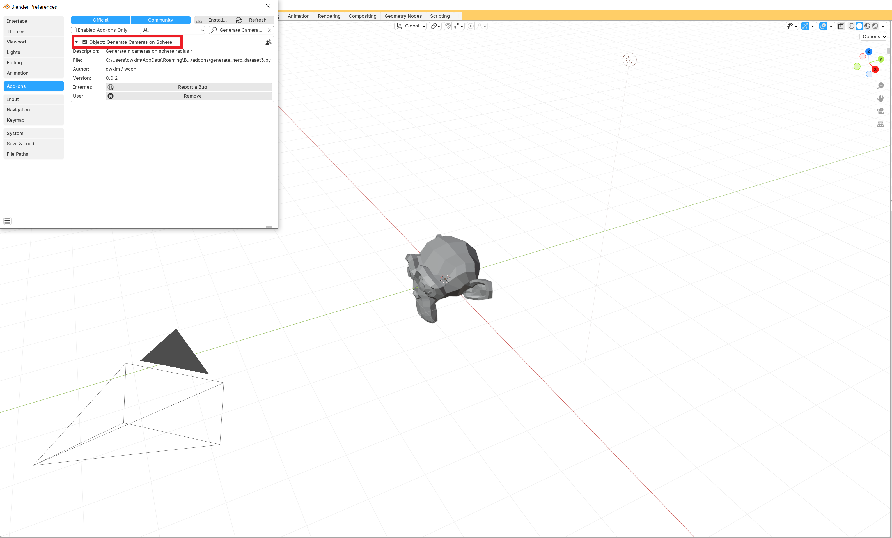
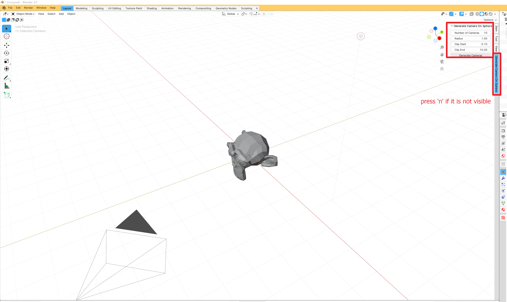
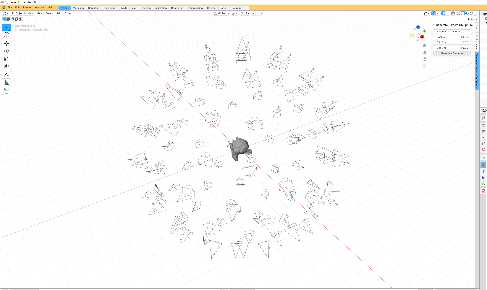

# blender-gen-cams-on-sphere-addons
Blender addon : generate cameras on sphere
This script is blender add-on that generate cameras directing center (0, 0, 0), located at surface of sphere

### Install
1. Edit - Preference

2. Add-ons - Install - choose .py

3. enable add-ons

### Usage

> if add-on is not visible, press 'n'

#### parameters
- `Number of Cameras` : the number of cameras
- `Radius` : radius of sphere
- `Clip Start/End` : clip options for rendering cameras

